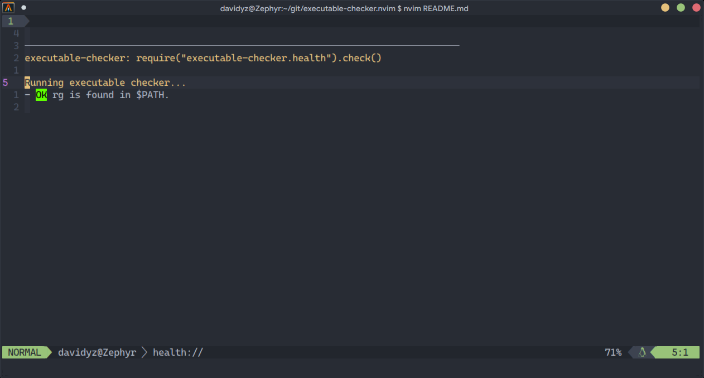

# Executable-checker.nvim

This is a plugin to help checking whether you're missing some external executable commands.  

[mason.nvim](https://github.com/williamboman/mason.nvim) is great, but it does not cover everything. 
For example, in [`telescope.nvim`](https://github.com/nvim-telescope/telescope.nvim)
it's quite common to use the `rg` command for in-text live grep. When sharing a configuration 
across multiple machines, it becomes a problem because sometimes people loose track of what 
external binaries they need to install.

# Usage

## Add executables to be checked

### As a plugin user

Add this plugin to your plugin manager and call the setup function with the
executables that you which to run `:checkhealth` with.

An example config for [`lazy.nvim`](https://github.com/folke/lazy.nvim):
```lua
{
    "Davidyz/executable-checker.nvim",
    opts = { executables = { "rg" } },
    config = true,
}
```

### As a plugin developer

If your plugin depends on a specific external command and you want to use this plugin to give users a nice 
way to check for external dependencies, you can use this plugin as well. 

You can put this in your code:
```lua
local status, checker = pcall(require, 'executable-checker')
if status then
  checker.add_executable("some_ext_command")
end
```
This way, if your plugin is loaded, when the user run `:checkhealth` or `:checkhealth executable-checker`, 
`some_ext_command` will show up in the checkhealth page.

## Running the check

Simply run `:checkhealth` or `:checkhealth executable-checker` in normal mode. You will see a report
similar to the following.


